# Securely store and share documents  

Data provides a critical foundation for every operation of your organization. Organizations collect a lot of data, including documents, from its customers. It is very important for organizations to have a robust security mechanism to secure sensitive customer documents. In addition to securing these documents using authentication and authorization of application, data should be encrypted and stored in a secure storage.

In the financial services domain, businesses collect, generate and store documents. Customer on-boarding, Loan origination or Know your customer are some common scenarios.

This code pattern focusses on the two specific processes in a banking scenario:  
- Opening of a savings bank account.
- Loan origination.

The customer submits documents for identification proof and address proof during the opening of a Savings account at a bank. These documents are stored in a shared storage. These documents are verified and approved for the opening of the Savings account. Next, the customer applies for a loan with loan department of the bank. The loan department needs the identification proof and address proof as part of the loan approval process. The customer does not need to re-submit these documents as it has been already submitted during the savings account opening. These documents are accessed from the shared storage by the Loan deparment official for processing the loan application.

This code pattern will demonstrate the following:
- Deploying a simple `account opening` banking application on OpenShift.
- How to integrate [Security Verify](https://www.ibm.com/products/verify-saas) with the banking application to provide authentication and authorization for users.
- How to securely store customer provided documents to [IBM Cloud Object Storage](https://cloud.ibm.com/docs/cloud-object-storage?topic=cloud-object-storage-about-cloud-object-storage).
- Data Encryption using [IBM Key Protect for IBM Cloud](https://www.ibm.com/cloud/key-protect).
- Securely access the stored customer documents for a `loan approval` process.

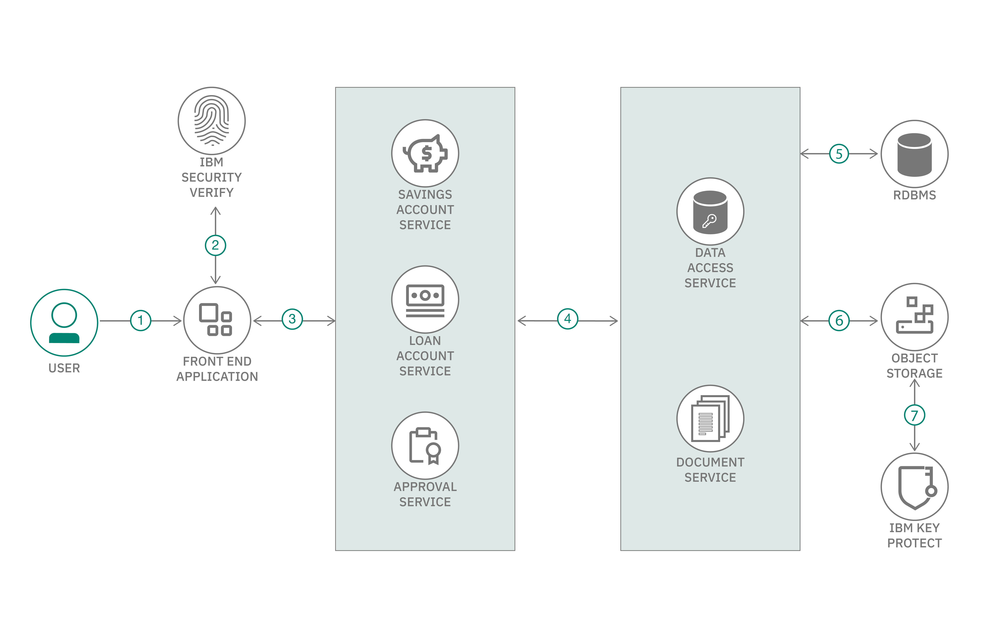

## Flow
1. User(end user/bank official) access the application.
2. User registration/login to the application.
3. Front end application accesses.
- The savings account service to get savings account details.
- The loan account service to apply/get loan account details.
- The approval service (bank official) to approve/reject savings account and loan account requests.
4. The services (savings account, loan account and approval) use data access service and document access service to store/retrieve account details and documents to database and IBM Cloud Object Storage.
5. Database to store account details.
6. IBM Cloud Object Storage to store user documents.
7. Documents are encrypted in IBM Cloud Object Storage.

## Prerequisites
- [IBM Cloud account](https://cloud.ibm.com/)
- [Red Hat OpenShift instance](https://cloud.ibm.com/kubernetes/catalog/create?platformType=openshift)
- [Git client](https://git-scm.com/downloads)
- [The OpenShift CLI (oc)](https://cloud.ibm.com/docs/openshift?topic=openshift-openshift-cli)

## Steps
1. [Clone the repository](#1-clone-the-repository)
2. [Create IBM Cloud Services instances](#2-create-ibm-cloud-services)
3. [Configuration of services](#3-configuration-of-services)
4. [Deploy Microservices](#4-deploy-microservices)
5. [Access the Application](#5-access-the-application)

### 1. Clone the repository

From a command terminal, run the below command to clone the repo:
```
git clone https://github.com/IBM/store-and-access-documents-securely
```

### 2. Create IBM Cloud Services instances

#### 2.1 Sign up for IBM Security Verify

Click [Security Verify](https://www.ibm.com/account/reg/signup?formid=urx-30041) to sign up for Security Verify. After you sign up for an account, the account URL (https://[tenant name].verify.ibm.com/ui/admin) and password is sent in an email.

#### 2.2 Create IBM DB2 Service instance

In [IBM Cloud Catalog](https://cloud.ibm.com/catalog) search of DB2. Click on the Db2 tile.
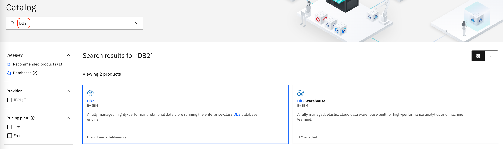.

Select an appropriate plan. Read and accept the license agreement. You may leave the other options to their default values. Click on `Create` button. It will take a minute or so to provision an instance.

**Make a note of service credentials**
- Click the newly created db2 entry in [IBM Cloud Resource list](https://cloud.ibm.com/resources)
- Click `Service credentials` on the left hand side navigation menu. If there are no credentials, then click on `New credential` button and create new credentials. 

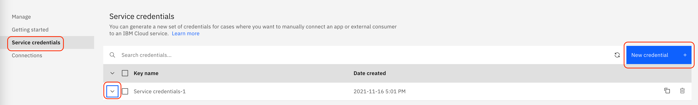

- Copy the credentials and paste the contents in the file `<cloned repo parent folder>/sources/data-access-service/src/main/resources/credentials-db2.json`. 
- Make a note of `username` value. This value will be used to create database tables.
- Save the file.

#### 2.3 Create Cloud Object Storage instance

Use the following commands to create the service instance:

```
  ibmcloud login ## Login using CLI if not done already
  ibmcloud target -r <region_name> -g <resource_group_name> -o <org_name> -s <space_name>
  ibmcloud resource service-instance-create <instance-name> cloud-object-storage lite global ## Make a note of the GUID in the output
  ibmcloud resource service-key-create skey --instance-id <GUID of Object Storage instance noted above>  ## it will create a service id, make a note of that
```

Make a note of service credentials, it will be required later.

#### 2.4 Create Key Protect Service instance

Create a Key protect service instance using the following commands:

```
ibmcloud resource service-instance <instance-name> ## make a note of the GUID in the output
##install key protect plugin
ibmcloud plugin install key-protect -r "IBM Cloud"
ibmcloud kp region-set <region>  ##for example us-south
ibmcloud kp key create <name-of-the-key> -i <GUID of Key Protect instance noted above>
```

Make a note of service credentials to use in further steps.

### 3. Configure services

#### 3.1 Configure Key Protect

**Grant access of the Key Protect to the Object Storage**

Run the following command to create authorization policy:

```
ibmcloud iam authorization-policy-create cloud-object-storage kms Reader --source-service-instance-id [GUID of Cloud Object Storage Instance]  --target-service-instance-id [GUID of Key-Protect instance]
```

Get the root key CRN value using IBM Cloud Dashboard. You can refer to step 5 [here](https://developer.ibm.com/tutorials/encrypt-and-monitor-usage-of-objects-stored-in-ibm-cloud-object-storage/) for more details.

#### 3.2 Configure Security Verify

**Add a custom application**
- Login to Security Verify. Use the URL for your admin account that was sent to you in the confirmation email: https://[tenant name].verify.ibm.com/ui/admin.
- Select Applications from the menu on the left.
- To add an application, click Add application.
- Select Custom Application as the application type, then click Add application.
- Specify a name for the application. Then, on the General tab, specify a company name.
- Click the Sign-on tab. Configure SSO using the OpenID Connect based authentication with Authorization code scheme. Specify these values:
  - For the Sign-on method, select Open ID Connect 1.0.
  - For the Application URL, enter the URL you noted for the front end UI application
  - For the Grant types, check Authorization code.
  - Uncheck Require proof key for code exchange (PKCE) verification.
  - For Redirect URIs, enter the re-direct URL on the front end application. 
  - Click Save to save this SSO configuration.
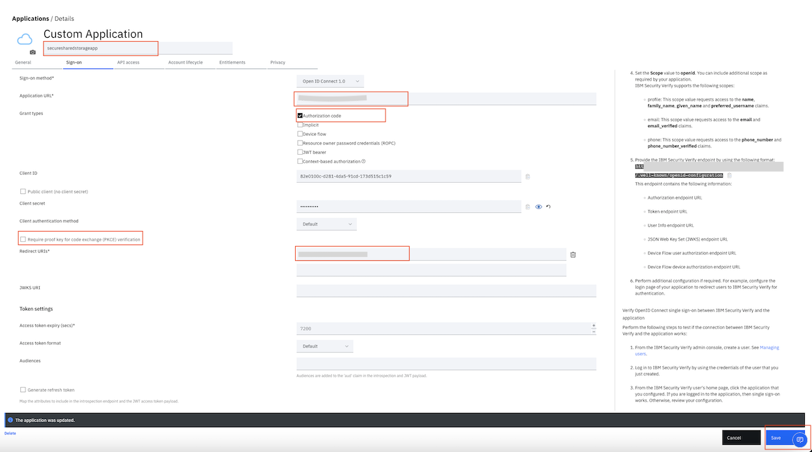
- Click the Entitlements tab. For the Access Type, select Automatic access for all users and groups. Click Save to save the custom application.
- Click the Sign-on tab. Note down the **client ID and the client secret**. This is needed for configuring the front-end gateway service.

**Note Security Verify endpoints**
In the far right information pane, note down the IBM Security Verify endpoint.

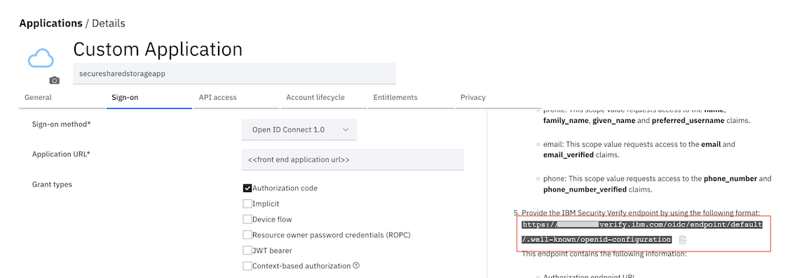.

Then, note down the following endpoints: **authorization_endpoint, token_endpoint and introspection_endpoint**. These will be needed to configure our application microservices to integrate with Security Verify.

**Note profile id**
Note the profile id.It is needed in configuring the front-end gateway service.

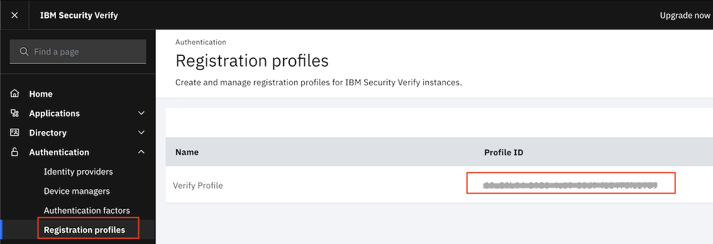.

**Add an API Client**
- Click on the `API Access` tab on application settings
- Click on `Add API Client` button
- Enter a name and click on `Save`
- Again click `Save` on the parent settings page. The credentials will now be generated.

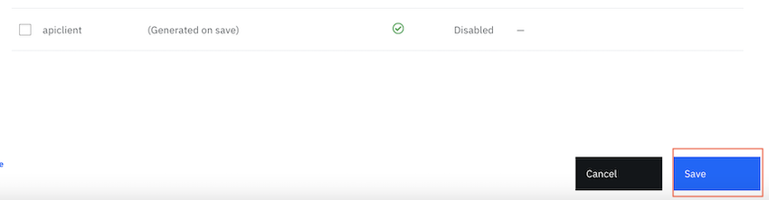
- Select the added `API Client`. On the right pane, the generated credentials can be copied. Make a note of the credentials. They will be needed for the `Approval service` configuration. Also note that this is different from the `client-id` and `client-secret` we noted when you created the SSO configuration. 

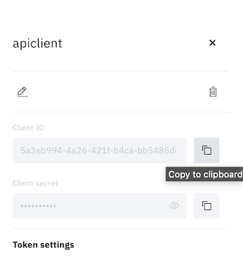

**Add users in Security Verify**

Let us add two users `savings_official` and `loan_official`. These user names will be used by the bank employees in this code pattern.

Click on `Add user `.

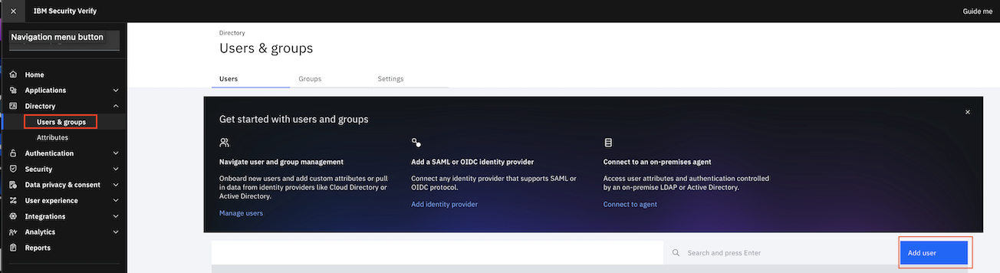

Enter the user details as shown for user `savings_official`. Enter a valid e-mail. The password will be emailed to the specified address. Click `Save`.

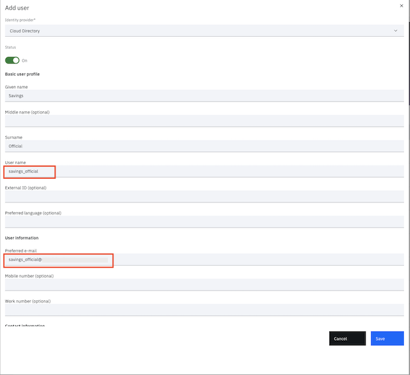

Repeat the above steps to create a user for `loan_official`.

>Note: The same e-mail id can be used for both the users.

#### 3.3 Configure DB2 database

**Create database tables**
- Click the newly created db2 entry in [IBM Cloud Resource list](https://cloud.ibm.com/resources)
- Click on `Go to UI`
- Click the `SQL` (`Run SQL` when you expand the menu) tile

  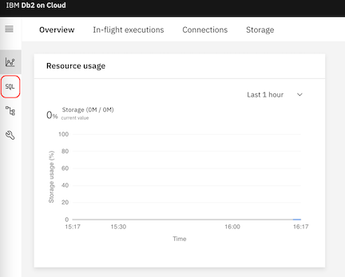

- Click on `From file` and select `<cloned repo parent folder>/sources/data-access-service/dbscripts.sql`. Click `Open`.
- The scripts to create tables are copied to SQL editor.
- Update all the occurances of `<schema_name>` with the schema name that was noted above.
- Click `Run all` option.
- The results of running these queries are shown on the right hand side of the SQL editor. Verify that all the tables, as mentioned in script, are created.

### 4. Deploy Microservices

**Login to your OpenShift cluster from command line**

Login to your OpenShift cluster. Access the `IBM Cloud Dashboard > Clusters (under Resource Summary) > click on your OpenShift Cluster > OpenShift web Console`. Click the dropdown next to your username at the top of the OpenShift web console and select Copy Login Command. Select Display Token and copy the oc login command from the web console and paste it into the terminal on your workstation. Run the command to login to the cluster using `oc` command line.

#### 4.1 Deploy Data Access Service
On the terminal window, change directory to `<cloned repo parent folder>/sources/data-access-service`. 

Run the following commands to deploy `data access service`.
```
oc new-project ssd-das
mvn clean install
oc new-app . --name=data-access-service --strategy=docker
oc start-build data-access-service --from-dir=.
oc logs -f bc/data-access-service
oc expose svc/data-access-service
```

Ensure that the application is started successfully using the command `oc get pods`. Also make a note of the route using the command `oc get routes`. The route will be provided in the configuration of other microservices requiring integration with `data access service`.

#### 4.2 Deploy Document Access Service

On the terminal, run the following commands.

```
cd <cloned repo parent folder>/sources/document-access-service
cp .env.sample .env
```

Update the object storage service and key protect service credentials in `.env` and save it.

Run the following commands to deploy `document-access-service`.

```
  oc new-project document-access
  oc new-app . --name=document-access-service --strategy=docker
  oc start-build document-access-service --from-dir=.

  oc logs -f bc/doc-access-service ## it takes time and wait till it gets completed
  oc get pods 

  oc expose svc/doc-access-service
  oc get routes 
```

Ensure that the application is started successfully using the command `oc get pods`. Also make a note of the route using the command `oc get routes`. The route will be provided in the configuration of other microservices requiring integration with `document access service`.

***Create bucket***

Run the API `http://<your_service_route>/create-bucket-kp` on your browser to create bucket in your cloud object storage instance. It will create the bucket with the name provided in `.env`.

#### 4.3 Deploy Approval Service

Approval Service accesses Data Access Service. So, you need to update the file `<cloned repo parent folder>/sources/approval-service/src/main/resources/config/config.properties`. Update the entry `DAS_BASE_URL` to `http://<data-access-service-route>/DAS/` as noted in [section 4.1](#41-deploy-data-access-service).

Enter the `introspection_endpoint` url noted in the `Note Security Verify endpoints` section above.
Enter the `client_id` and `client_secret` noted in the `Add an API Client` section above.
```
TOKEN_URL=https://{{tenant_id}}.verify.ibm.com/v1.0/endpoint/default/introspect
CLIENT_ID=xxxxxxxx-xxxx-xxxx-xxxx-xxxxxxxxxxxx
CLIENT_ID=xxxxxxxxxx
USER_URL=https://{tenant_url}/v2.0/Users
```
Save the file.

Change directory to `<cloned repo parent folder>/sources/approval-service` and run the following commands to deploy `approval service`.
```
oc new-project ssd-approval
mvn clean install
oc new-app . --name=approval-service --strategy=docker
oc start-build approval-service --from-dir=.
oc logs -f bc/approval-service
oc expose svc/approval-service
```

Ensure that the application is started successfully using the command `oc get pods`. Also make a note of the route using the command `oc get routes`. The route will be provided in the configuration of other microservices requiring integration with `approval service`.

#### 4.4 Deploy Loan Accounts Service
On a terminal window, change directory to `<cloned repo parent folder>/sources/loan-service`. Ensure you are logged in to the cluster from command line. 

**Add security verify configuration for token instrospection**

Open the file `verify.config` file under `src/main/resources` folder.
Enter the `introspection_endpoint` url noted in the `Note Security Verify endpoints` section above.
Enter the `client_id` and `client_secret` noted in the `Add a custom application` section above.
```
introspectionUrl=https://{{tenant_id}}.verify.ibm.com/v1.0/endpoint/default/introspect
clientId=xxxxxxxx-xxxx-xxxx-xxxx-xxxxxxxxxxxx
clientSecret=xxxxxxxxxx
```
Save the file.

Open the file `config.properties` file under `src/main/resources` folder. Update the `Data Access Service` url and `Document Access Service` url in the file as shown below:
```
documentSvcUrl={{Document Access Service URL}}/upload-file
dataAccessSvcUrl={{Data Access Service URL}}/DAS/loan-account
```
Now, go back to the directory `<cloned repo parent folder>/sources/savings-service`.

Run the following commands to deploy `Loan account service`.
```
oc new-project loan-project
mvn clean install
oc new-app . --name=loan-service --strategy=docker
oc start-build loan-service --from-dir=.
oc logs -f bc/loan-service
oc expose service/loan-service
```

Ensure that the application is started successfully using the command `oc get pods`. 

Make a note of the route to the `loan-service` using the command `oc get routes`. The route will be provided in the configuration of other microservices requiring integration with `loan-service`. 

#### 4.5 Deploy Savings account service

On a terminal window, change directory to `<cloned repo parent folder>/sources/savings-service`. Ensure you are logged in to the cluster from command line. 

**Add security verify configuration for token instrospection**

Open the file `verify.config` file under `src/main/resources` folder.
Enter the `introspection_endpoint` url noted in the `Note Security Verify endpoints` section above.
Enter the `client_id` and `client_secret` noted in the `Add a custom application` section above.
```
introspectionUrl=https://{{tenant_id}}.verify.ibm.com/v1.0/endpoint/default/introspect
clientId=xxxxxxxx-xxxx-xxxx-xxxx-xxxxxxxxxxxx
clientSecret=xxxxxxxxxx
```
Save the file.

Open the file `config.properties` file under `src/main/resources` folder. Update the `Data Access Service` url and `Document Access Service` url in the file as shown below:
```
documentSvcUrl={{Document Access Service URL}}/upload-file
dataAccessSvcUserUrl={{Data Access Service URL}}/DAS/user
dataAccessSvcSavingUrl={{Data Access Service URL}}/DAS/savings-account
```
Now, go back to the directory `<cloned repo parent folder>/sources/savings-service`.

Run the following commands to deploy `Savings account service`.
```
oc new-project savings-project
mvn clean install
oc new-app . --name=savings-service --strategy=docker
oc start-build savings-service --from-dir=.
oc logs -f bc/savings-service
oc expose service/savings-service
```

Ensure that the application is started successfully using the command `oc get pods`. 
Make a note of the route to the `saving-service` using the command `oc get routes`. The route will be provided in the configuration of other microservices requiring integration with `savings-service`.

#### 4.6 Deploy Frontend Service

On the terminal, access the code of frontend-service using the following commands.

```
cd <cloned repo parent folder>/sources/frontend-service
cp .env.sample .env
```

Update the security verify credentials and other deployed microservices URL in `.env`. The `client-id` and `client-secret` should be the one noted in the `Add a custom application` section. The `profile-id` noted earlier must be entered against the `REGISTRATION_PROFILE_ID`. 

```
TENANT_URL=https://[tenant-id].verify.ibm.com
CLIENT_ID=xxxxxxxx-xxxx-xxxx-xxxx-xxxxxxxxxxxx
CLIENT_SECRET=xxxxxxxxxx
REDIRECT_URI=http://[your deployed application route]/redirect
RESPONSE_TYPE=code
FLOW_TYPE=authorization
SCOPE=openid
REGISTRATION_PROFILE_ID=xxxxxxxx-xxxx-xxxx-xxxx-xxxxxxxxxxxx
~                                                            
```
>Note: REDIRECT_URI should be `<your deployed application route>/redirect`. The base URL of the deployedfront-end service must be replaced for the `REDIRECT_URI`. The `REDIRECT_URI` must match the configuration on `Security Verify` that you specified in `Add a custom application` section.

Run the following commands to deploy `frontend-service` after logging into the OpenShift cluster from command line. .

```
  oc new-project frontend-svc
  oc new-app . --name=frontend-service --strategy=docker
  oc start-build frontend-service --from-dir=.

  oc logs -f bc/frontend-service ## it takes time and wait till it gets completed
  oc get pods ##pod should be in running state else wait for sometime

  oc expose svc/frontend-service
  oc get routes 
```

Ensure that the application is started successfully using the command `oc get pods`. Also make a note of the route using the command `oc get routes`. The route will be used to access the application.

### 5. Access the Application

Access the application using the route of frontend service deployed in step 4.6. As a first step, you need to submit request for savings account creation as shown below.


Once the request of savings account is submitted, it goes for approval to Savings branch official. In this code pattern, we have already created credentials of savings branch official in step 3.2. Savings branch Official logs-in using appropriate credentials and gets a list of savings account requests submitted newly. The official person verifies the data and document provided by the user and then accordingly approve or reject the request as shown below.


Upon savings account approval, user's credentials gets created and emailed to user. Using those credentails, user can log-in to check his savings account details. So far, only savings account of that user exists. If the user wants to apply for loan, he can do as shown below. For loan, he needs to provide all the required details and documents similar to savings account.

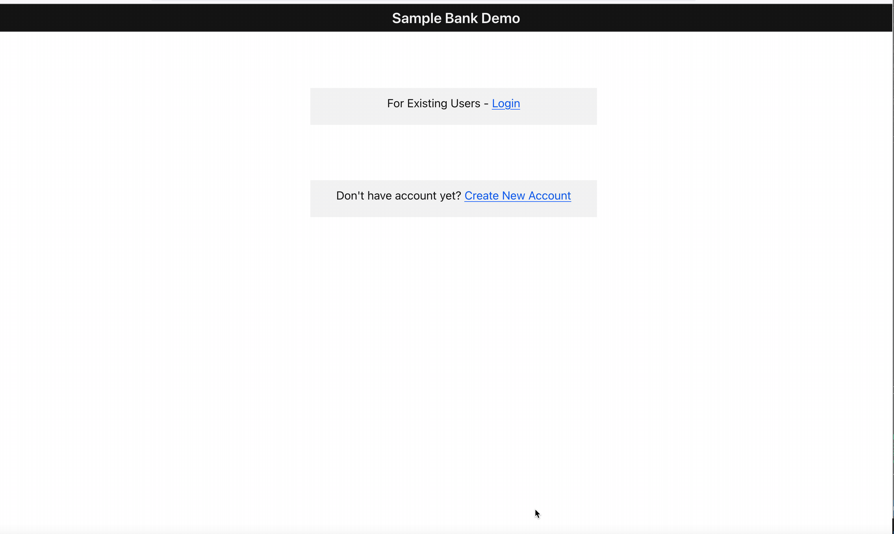

Loan request goes to loan branch official. The official verifies all the required details and document and accordingly approve or reject the request.


If the loan request is approved, it will be visible on user dashboard. User can login again and check as shown below.

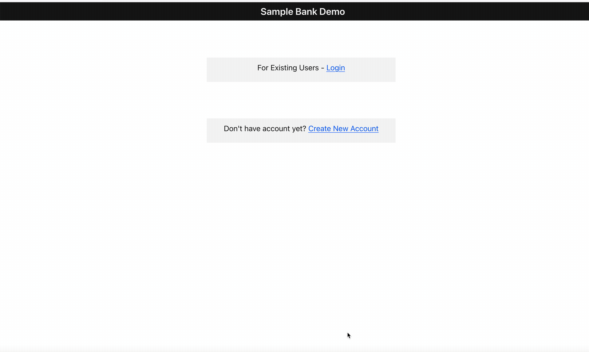


## Summary
In this code pattern, you saw how a secure storage solution can be implemented on IBM Cloud. In this application, only the authenticated and authorized user can access the application using IBM Security Verify. In addition, all the microservices were protected using token introspection with Security Verify. The documents were encrypted using IBM Key Protect and stored securely on IBM Cloud Object Storage.

This solution is applicable to all business processes where documents need to be stored and accessed securely.

## License
This code pattern is licensed under the Apache License, Version 2. Separate third-party code objects invoked within this code pattern are licensed by their respective providers pursuant to their own separate licenses. Contributions are subject to the [Developer Certificate of Origin, Version 1.1](https://developercertificate.org/) and the [Apache License, Version 2](https://www.apache.org/licenses/LICENSE-2.0.txt).

[Apache License FAQ](https://www.apache.org/foundation/license-faq.html#WhatDoesItMEAN)
